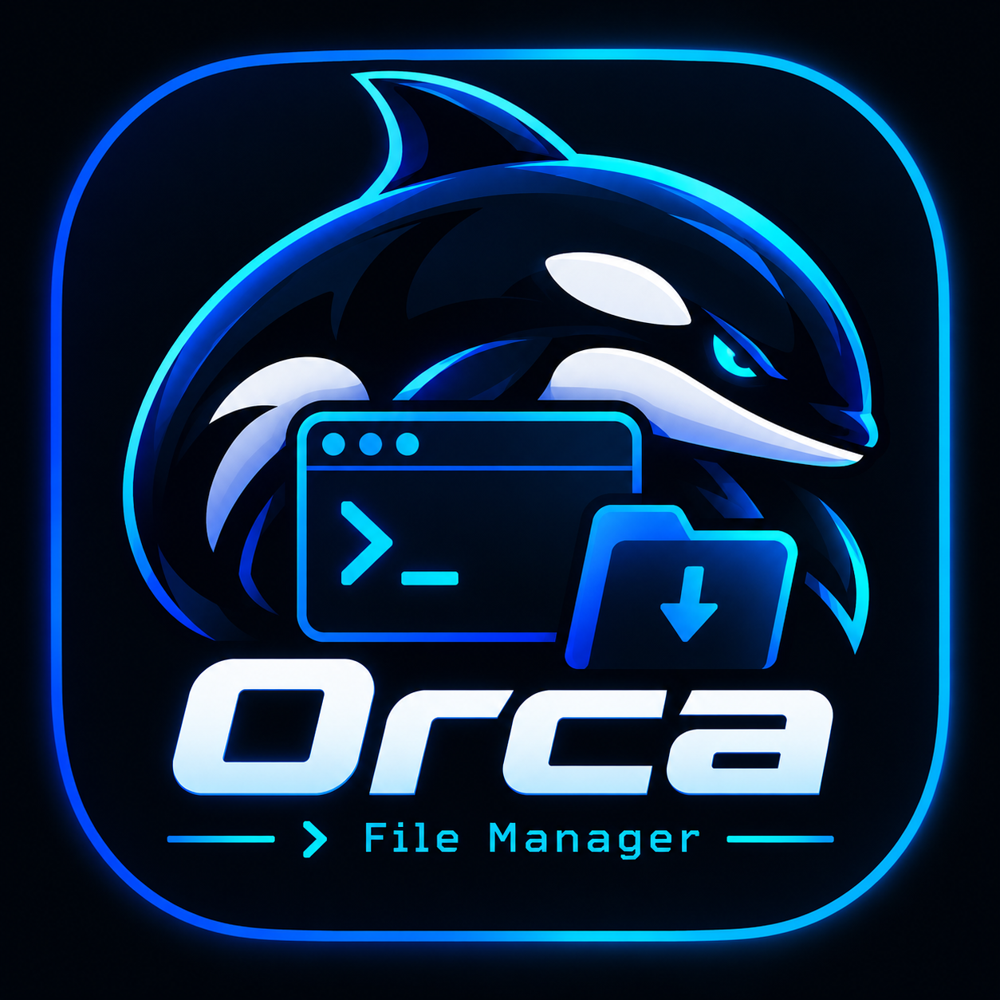

<div align="center">
  
  <h1>OrcaFileManager 🐋</h1>
  <p><strong>A professional, cross-platform terminal file manager — like Dolphin, but with steroids.</strong></p>
  <p>
    
    
    
    
  </p>
</div>

---

## ✨ Features

- 📂 **2-pane layout** — file browser + live preview side by side
- 🖱️ **Mouse + keyboard** — drag dividers to resize, click to navigate
- 👁️ **Syntax-highlighted preview** — text, code, directories
- 🎨 **4 built-in themes** — Default, Transparent, Pink (Synthwave), Carbon
- 🔍 **Hidden files toggle** — show/hide dotfiles instantly
- ✏️ **In-terminal editor** — edit files with your `$EDITOR` (vim, nano, nvim…)
- 💾 **Safe trash** — send files to the OS trash instead of permanently deleting
- 🚀 **Cross-platform** — Linux, macOS, Windows

---

## ⚡ Quick Install (one command)

```bash
pip install git+https://github.com/nbmsystemas/OrcaFileManager.git
```

Then launch with:

```bash
orca
```

---

## 🔄 Update

To get the latest changes at any time:

```bash
orca --update
```

This pulls the latest version directly from GitHub and reinstalls automatically.

---

## 🛠️ Developer Install

```bash
git clone https://github.com/nbmsystemas/OrcaFileManager.git
cd OrcaFileManager
python -m venv venv
source venv/bin/activate      # On Windows: venv\Scripts\activate
pip install -e .
orca
```

---

## ⌨️ Keybindings

| Key | Action |
|-----|--------|
| `↑` / `↓` | Navigate files |
| `Enter` | Open file / Enter directory |
| `📁 ..` | Go to parent directory |
| `h` / `Backspace` | Go up one level |
| `~` | Go to home directory |
| `/` | Go to root `/` |
| `Ctrl+G` | Go to any path |
| `Ctrl+H` | Toggle hidden files |
| `e` | Edit file with `$EDITOR` |
| `[` / `]` | Shrink / Expand file column |
| `t` | Cycle through themes |
| `q` | Quit |

---

## 🎨 Themes

Cycle through themes with `t`:

| Theme | Description |
|-------|-------------|
| **Default** | Textual dark background |
| **Transparent** | Respects your terminal's background & opacity |
| **Pink** | Synthwave / Cyberpunk neon pink |
| **Carbon** | Elegant dark grey, flat style |

> **Transparency tip:** For the transparent theme to work, your terminal emulator must have compositing enabled (e.g. `opacity: 0.9` in Alacritty, `background_opacity 0.9` in Kitty).

---

## 📋 Requirements

- Python 3.10+
- `textual`, `rich`, `send2trash`, `pillow`

All dependencies are installed automatically via `pip`.

---

## 📄 License

MIT © [nbmsistemas](https://github.com/nbmsystemas)
